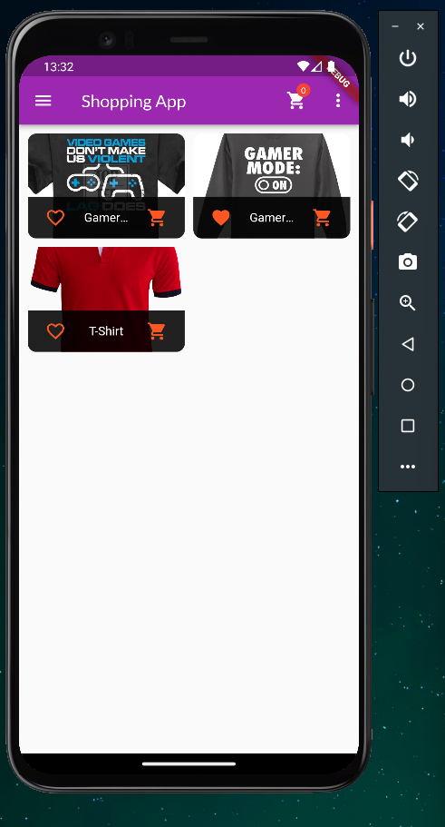
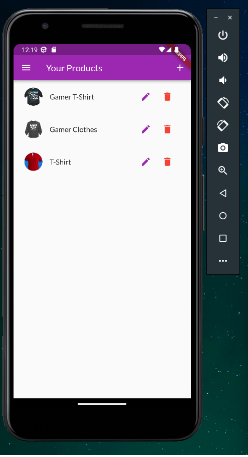

<!-- TODO: Finish this readme before push to github -->

<!-- Project Shields -->
[![Contributors][contributors-shield]][contributors-url]
[![Forks][forks-shield]][forks-url]
[![Stargazers][stars-shield]][stars-url]
[![Issues][issues-shield]][issues-url]
[![GNU License][license-shield]][license-url]
[![LinkedIn][linkedin-shield]][linkedin-url]

<!-- Shield sources -->
[contributors-shield]: https://img.shields.io/github/contributors/rafaelqueiroz88/flutter-shopping-app.svg?style=for-the-badge
[contributors-url]: https://github.com/rafaelqueiroz88/flutter-shopping-app/graphs/contributors
[forks-shield]: https://img.shields.io/github/forks/rafaelqueiroz88/flutter-shopping-app?style=for-the-badge
[forks-url]: https://github.com/rafaelqueiroz88/flutter-shopping-app/network/members
[stars-shield]: https://img.shields.io/github/stars/rafaelqueiroz88/flutter-shopping-app?style=for-the-badge
[stars-url]: https://github.com/rafaelqueiroz88/flutter-shopping-app/stargazers
[issues-shield]: https://img.shields.io/github/issues/rafaelqueiroz88/flutter-shopping-app.svg?style=for-the-badge
[issues-url]: https://github.com/rafaelqueiroz88/flutter-shopping-app/issues
[license-shield]: https://img.shields.io/github/license/rafaelqueiroz88/flutter-shopping-app.svg?style=for-the-badge
[license-url]: https://github.com/rafaelqueiroz88/flutter-shopping-app/blob/master/LICENSE
[linkedin-shield]: https://img.shields.io/badge/-LinkedIn-black.svg?style=for-the-badge&logo=linkedin&colorB=555
[linkedin-url]: https://www.linkedin.com/in/rafael-queiroz-0074a4139/

<br />

# Shopping App

<table border="0">
  <tr>
    <td align="center">
      
    </td>
    <td>
      This is a generic Shopping App build with Flutter. This App can Create, Edit and Delete products to use as Shopping Owner and also can be use as a customer. Customers can set or unset favorites and filter them. Add or remove products from cart and create an order with all products in the cart. Orders are also listed.
    </td>
  </tr>
</table>

<br />

## Getting Started

This project uses some libraries. Check `pubspec.yml` to check these libraries and then run the follow command:
```
flutter pub get
```

Then run the project with or without debugging. <br />

## About the Project

This project has no back-end project, but uses Firebase to manage app features. Make sure to have internet connection to access.

<table border="0">
  <tr>
    <td>
      
    </td>
    <td>
      Dart is the main language in this project since there are no back-end server to provide data.
    </td>
  </tr>
  <tr>
    <td>
      
    </td>
    <td>
      This project counts on Flutter since Flutter is the most popular Dart Framework.
    </td>
  </tr>
  <tr>
    <td>
      
    </td>
    <td>
      As a sample project, Firebase is set to provide and controlls data.
    </td>
  </tr>
  <tr>
    <td>
      
    </td>
    <td>
      There are State Management resources set for data provide and management.
    </td>
  </tr>
  <tr>
    <td>
      
    </td>
    <td>
      Since Firebase is set as back-end server, all communication was made with http requests to the API.
    </td>
  </tr>
</table>

## About Features

<details open="open">
  <summary style="font-size: 18px;">Content</summary>
  <p>
    This project contains only basic features for <i>E-Commerce</i> to work.
    Nonetheless it explores most used development resources in <b>Flutter</b>.
  </p>
  <p>
    There are some resources that uses State management, http requests, and some other stuffs incomming.
  </p>
</details>

<details>
  <summary style="font-size: 18px;">Products (Customer View)</summary>
  <table border="0">
    <tr>
      <td width="25%">
        
      </td>
      <td>
        This is the main screen. It uses HTTP requests to load data from the server (Firebase) and state management to controlls those loaded data.
      </td>
    </tr>
  </table>
</details>

<details>
  <summary style="font-size: 18px;">Products (Manager View)</summary>
  <p>
    Management should not be a resource available to customers. As the project has no back-end or Dashboards, resources like this must be managed inside the Application.
  </p>
  <table border="0">
    <tr>
      <td>
        This is the product management Screen. It is possible to create, edit and delete products. This resource also makes http requests and uses state management.
      </td>
      <td width="25%">
        
      </td>
    </tr>
  </table>
</details>

<details>
  <summary style="font-size: 18px;">Orders </summary>
  <table border="0">
    <tr>
      <td width="25%">
        
      </td>
      <td>
        Orders list can be check in this resource. There are no possibilities to edit or create. Only list and display more details.
      </td>
    </tr>
  </table>
</details>
